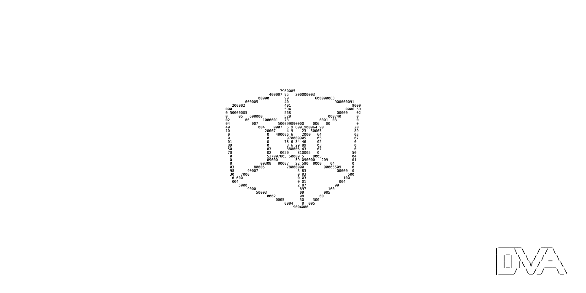

# Hello, I'm DeterminedMinsky

## About Me

I am working at [DVA (Data Variance Authority)](https://github.com/data-variance-authority) . My mission is to create high-quality software and ensuring data life-cycle across various dimensions.

## Skills

- Programming languages: Python, Go, C++
- Web development: React, Vite, Tailwind CSS

## Experience
- DVA

## Education
- DVA
